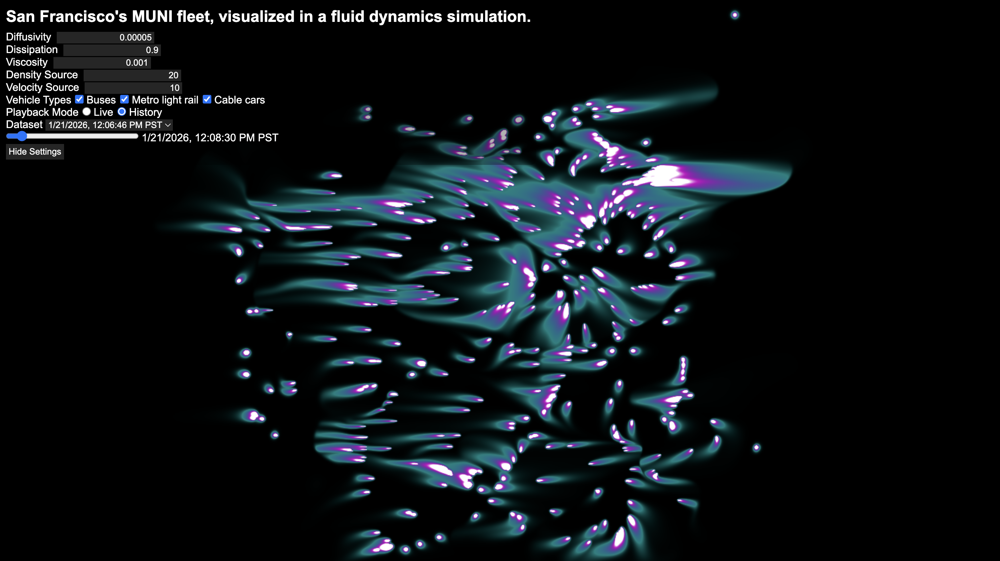

# San Francisco's MUNI fleet, visualized in a WebGPU fluid dynamics simulation



This is a GPU-accelerated web browser implementation of Jos Stam's real-time fluid dynamics solver originally presented in his seminal paper "Stable Fluids" from 1999. This project additionally includes a light backend which provides live and historical vehicle positions of San Francisco's MUNI (public transit) fleet to the frontend fluid simuation. Together, these create a fun way to visualize real-world data (and a rewarding way for me to learn the basics of web development, a new graphics API, and GPGPU)!

## Readme Contents

1. [Application Structure](#application-structure)
2. [How to Run](#how-to-run)
3. [Discussion](#discussion)
4. [To-Do](#to-do)
5. [References](#references)

## Application Structure

### Frontend

- **JavaScript + HTML + CSS**: Provide user controls and make requests to the backend API.
- **JavaScript + WebGPU**: Simulate and render the fluid simulation.
  
### Backend

- **Python + SQLAlchemy**: Fetch and store real-time transit vehicle data from the 511 Open Data API.
- **Python + FastAPI**: Provide API endpoints for requesting stored vehicle data.

## How to Run

### Requirements

- Python 3.13 or higher
- [Browser with WebGPU support](https://developer.mozilla.org/en-US/docs/Web/API/WebGPU_API#browser_compatibility)

### Run the Simulation

Install the Python packages listed in `requirements.txt` (ideally within a [venv](https://docs.python.org/3/library/venv.html) or [conda](https://docs.conda.io/en/latest/) environment).

```shell
# Create and activate venv environment
python -m venv .venv
source .venv/bin/activate

# Install reqs
pip install -r requirements.txt
```

Launch the FastAPI **API server** on port 8000.

```shell
fastapi run backend/main.py --port 8000
```

In another shell instance, launch an **HTTP server** on port 8001 at the `frontend/` directory. Open [http://localhost:8001](http://localhost:8001) in a web browser.

```shell
python -m http.server --directory frontend 8001
```

*Optionally*, in a third shell instance, launch the **fetcher process** to fetch live vehicle position information from the [511 Open Data API](https://511.org/open-data/transit).

```shell
cd backend
python -m src.services.fetcher
```

A few notes about the fetcher:

- Live vehicle positions are not required to run the simulation since I've run the fetcher in advance and recorded several vehicle position history datasets in the provided SQLite database at `backend/data/database.db`. The most recent "live" dataset is also saved at `backend/data/cache.pkl`. The backend implementation handles database and cache access automatically.
- If you would like to use "live" mode, fetching live data requires an [511 Open Data API token](https://511.org/open-data/token). The application expects the token to be saved in a text file at path `private/key.txt`.

## Discussion

### Fluid Simulation

In "Stable Fluids", Stam proposes an approach to physics-based fluid simulation which is computationally efficient enough to work in real-time while remaining numerically stable. Stam's demo code from 2003 implemented the solver's computations using plain C routines and used graphics hardware solely for rendering a visualization of the fluid, likely because the graphics pipeline prior to OpenGL 2.0 (introduced in 2004) was fixed-function and didn't support custom shaders.

This implementation is in JavaScript and uses WebGPU fragment shaders to capitalize on the semi-independent, per-pixel nature of each computation by massively parallelizing them on the GPU, resulting in huge performance gains (see the [performance results section](#gpu-performance-gain)). Even though Stam's C implementation achieves real-time frame rates, GPU acceleration enables high performance at much larger simulation sizes. (GPU acceleration in this manner is obviously also possible in web browsers through WebGL fragment shaders and in non-web contexts using other graphics APIs such as OpenGL, Vulkan, DirectX, and Metal.)

The fluid simulation is best visualized by rendering the density of a particular material as it moves through the system. Material density and fluid velocity are input into the simulation as "sources" which are then advected and diffused over time. Sources can be provided arbitrarily, based for example on fixed values, user input, or in this case, external data.

### SF MUNI Vehicle Positions

San Francisco Bay Area transit data is publicly available through the [511 Open Data Portal](https://511.org/open-data/transit).

Each frame, density sources are added to the simulation based on the GPS position of each transit vehicle (bus, light rail vehicle, or cable car). Additionally, velocity sources are added at the same position with values based on the apparent velocity (change in GPS coordinates) of each vehicle.

Because API tokens are subject to a rate limit of 60 requests per 3600 seconds, it was important to budget API requests. This is accomplished by only making requests at some fixed time interval (e.g., 15 seconds) and by recording contiguous batches of vehicle position data to make the data available for "offline" use by the frontend fluid simulation.

The backend is implemented in Python. The **fetcher process** makes requests to the 511 Open Data Portal and uses SQLAlchemy to store vehicle data in a SQLite database. The **API server** uses FastAPI to expose custom backend API endpoints to the frontend, allowing it to read from the database via HTTP GET requests.

### GPU Performance Gain

Below are the frame times of the GPU-accelerated implementation (using WebGPU fragment shaders for computation) versus a CPU implementation (using native JavaScript). Both implementations use WebGPU to render to the HTML canvas. These tests were run on my M1 Macbook Pro.

| Simulation Size | CPU           | GPU            | Speedup |
| ---             | ---           | ---            | ---     |
| 1920 x 1080     | 7.30 s/frame  | 7.20 ms/frame  | 1014x   |
| 1024 x 1024     | 5.80 s/frame  | 2.83 ms/frame  | 2053x   |
| 256 x 256       | 219 ms/frame  | 0.367 ms/frame | 595x    |
| 64 x 64         | 13.1 ms/frame | 0.307 ms/frame | 42.6x   |

It's clear that using a JavaScript engine alone to run this particular physics-based simulation is prohibitively slow for real-time applications. Even with a compiled language like C++, CPU simulation struggles at high resolution—see my [stablefluids](https://github.com/joshuaeyu/stablefluids) repo, where I previously ported Stam's demo code to OpenGL 3.3.

<!-- 
1920x1080
GPU: 7.198600000113249 1000 = 7.199 ms/frame
CPU: 7302.243300000019 1000 = 7.302 s/frame
1024x1024
GPU: 2.825100000042468 1000 = 2.825 ms/frame
CPU: 5801.17149999997 1000 = 5.801 s/frame
256x256
GPU: 0.36689999990537764 1000 = 0.3669 ms/frame
CPU: 218.4602000000775 1000 = 218.5 ms/frame
64x64
GPU: 0.30690000001341106 1000 = 0.3 ms/frame
CPU: 13.063199999980629 1000 = 13 ms/frame 
-->

## To-Do

- Enforce boundary conditions
- Add vorticity
- Add presets
- Compare performance to a compute shader implementation
- Add environment setup scripts
- See if a Docker container makes sense

## References

### Literature

- [J. Stam, Stable Fluids, in *SIGGRAPH 1999 Conference proceedings: SIGGRAPH Annual Conference Series*, pp. 121-128, 1999.](https://www.josstam.com/_files/ugd/cf1fd6_898fe9b63df946689101b8d074f8efba.pdf)
- [J. Stam, Real-Time Fluid Dynamics for Games, in *GDC 2003 Conference proceedings: Game Developers Conference*, 2003.](https://www.josstam.com/_files/ugd/cf1fd6_9989229efbd34a26ba5ccd913721a2ac.pdf)
- [M. Harris, "Fast Fluid Dynamics Simulation on the GPU", in *GPU Gems*.  Upper Saddle River, NJ, USA: Pearson Education, Inc., 2004, ch. 38. [Online].](https://developer.nvidia.com/gpugems/gpugems/part-vi-beyond-triangles/chapter-38-fast-fluid-dynamics-simulation-gpu)

### Documentation

- [FastAPI](https://fastapi.tiangolo.com)
- [SQLAlchemy](https://www.sqlalchemy.org)
- [MDN: WebGPU API](https://developer.mozilla.org/en-US/docs/Web/API/WebGPU_API)
- [W3C: WebGPU Standard](https://www.w3.org/TR/WGSL/)
- [W3C: WebGPU Shading Language Standard](https://www.w3.org/TR/webgpu/)
